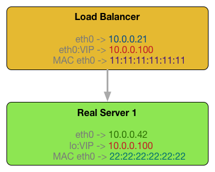
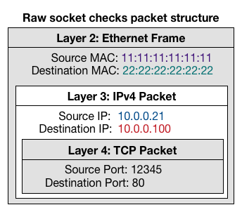

# Raw socket checkers

A collection of check scripts that uses _RAW_ sockets to force the destination
_MAC address_, suitable to be used for load balancers (_LB_) in direct routing
mode (_LVS-DR_) to ensure that the real server is indeed answering to packets
that have as destination IP the Virtual IP (_VIP_).

## The problem

Load balancers in direct routing mode (_LVS-DR_) usually works with this setup:

* The load balancer has the _VIP_ assigned to one interface as an alias.
* The incoming traffic into the _LB_ to the _VIP_ is modified at Layer 2 in the
  ethernet frame to change the destination _MAC address_ from the one of the
  _VIP_ interface on the _LB_ itself to the one of the real server's interface
  to which the _LB_ decided to route the traffic.
* The real servers have the _VIP_ assigned to their loopback interface as an
  alias in order to answer to traffic that has the _VIP_ as destination IP.
* The real servers are configured to not announce and reply to ARP requests the
  IPs in their loopback interface.



IF one of the real server is missing the configuration of the _VIP_ as an alias
of the `lo` interface, usually this is what happens:

* All the incoming traffic to that real server is rejected as not recognized by
  the Kernel as valid.
* The checks of _LB_ management softwares like _ldirectord_ or _keepalived_
  will not fail because their checks are performed using the real server IP as
  destination address.
* The statistics on the _LB_ don't show any anomaly because from the _LB_'s
  perspective the traffic was properly routed to the real server and because
  there is no NAT in place the responses from the real servers go directly to
  the client without any knowledge of it by the _LB_.
* Any monitor on the _VIP_ service will not clearly detect the issue and at
  most there will be some flapping checks when the request is routed to the
  failing real server.
* The _LB_ will continue to route the traffic to the real server until a manual
  intervention will fix the situation.
* The whole check is following a path that is different from the real traffic.

## Available alternatives

### Configuration management tools

While the enforcement of the _VIP_ configuration on the loopback of the real
servers could be done with any configuration management tool, it will usually
not ensure that the interface is actually up at all time.

### Alarming tools

While an alarming tool could obviously check the status of the loopback
interface on the real server at all time, it will still just raise an alarm and
a manual or automatic intervention would be needed. Also in the case of an
automatic intervention the usual delay between checks in the alarming tools
will not avoid that some traffic got lost.

## The proposed solution

The proposed solution is to check the real servers using the same kind of
packets that characterize the normal routed traffic from the _LB_.
To achieve that a _RAW_ socket is used to bypass both the ARP and the Kernel
networking stack that would not allow to use the _VIP_ as the destination IP
in the checks given that the _VIP_ is configured and announced on the _LB_
itself and the packets would not exit the _LB_ at all.
The real server _MAC address_ is resolved through ARP (for IPv4) and will be
used as the _destination MAC address_ for all the packets. The _destination IP_
instead will be set to the _VIP_. _RAW_ sockets are used in order to be able to
set all those values manually, by-passing the Kernel TCP stack.



### Caveat

In case of a cluster of _LBs_, usually the checks on the real servers are
performed by all the _LBs_, not only by the master one. Because the _LBs_ in
stand-by/backup mode don't have the _VIP_ configured, the Kernel would reject
the traffic in response to the checks performed using the _RAW_ sockets. In
this scenario the possible solutions are:
1. Block with iptables the outgoing reset packets sent by the Kernel.
1. Add the _VIP_ address to the loopback interface to all the _LBs_ in the
   cluster.
1. Fallback to standard checks using the real server IP on stand-by/backup
   _LBs_

The first two solutions requires a manual configuration on the _LBs_, while the
third one requires that the check is aware of the _LB_ role. In order to make
the checks aware of the role of the _LB_ to use the third solution, an option
is available on all checks (_-r_) that allow to specify the path of a file
where the _LB_ role is saved. The software that is in charge of changing the
_LB_ role will need to update this file accordingly.

## List of available checks

Because of the usage of _RAW_ sockets, all checks need to be run as _root_
or have the _CAP_NET_RAW_ capability.

* [TCP check](doc/check_tcp_raw.md)
* [HTTP GET check](doc/check_http_get_raw.md) (_BETA_)
* [HTTP check](doc/check_http_raw.md) (_BETA_)

### Dependencies

* GNU C compiler (i.e. _gcc_ package).
* GNU C Library: Development Libraries and Header Files (i.e. install
  _libc6-dev_ package (or equivalent) on Debian based distros, _glibc-devel_ on
  RedHat based ones).
* [HTTP checks only] OpenSSL development files (i.e. install _libssl-dev_
  package on Debian based distros, _openssl-devel_ on RedHat based ones).

### Compilation

To compile all checks just run:

```sh
make
```

* The binaries are created in the `bin/` directory.
* All the other build artifacts are created in the `build/` directory.
* Run `make clean` to clean all compiled artifacts.
* The checks can be compiled individually, using `make tcp`, `make http_get`
  or `make http`.
* All checks were tested on Debian 8 (jessie) and Fedora 23 Server.

## TODO

* Add Tests.
* Extract common parameters and options to a common parser.
* Support fragmented responses in HTTP checks.
* Support packet loss in HTTP checks.
* Accept also HTTP responses with LF only.
* Add IPv6 versions of the checks.
* Evaluate options to eventually support SSL.

## Useful resources

* [C Language Examples of IPv4 and IPv6 Raw Sockets for Linux](
  http://www.pdbuchan.com/rawsock/rawsock.html) by _P. David Buchan_. A very
  useful resource about _RAW_ sockets in _C_ with examples for all major
  network protocols.
